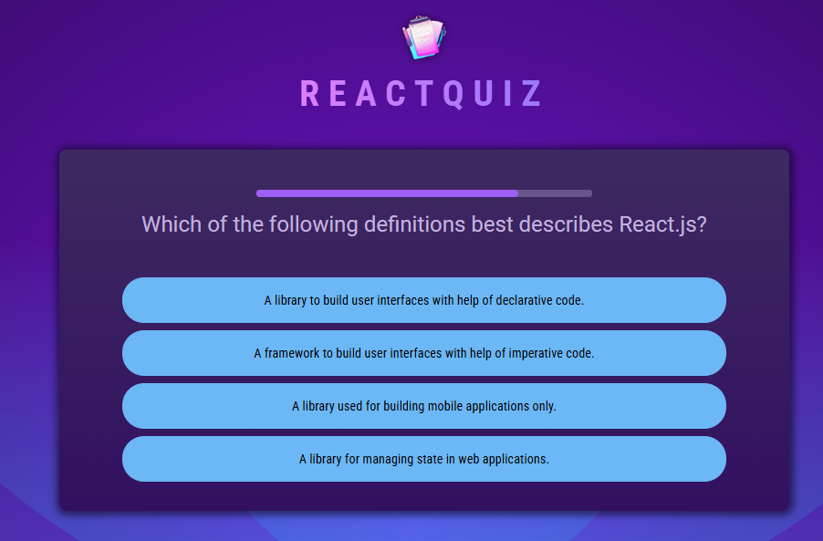
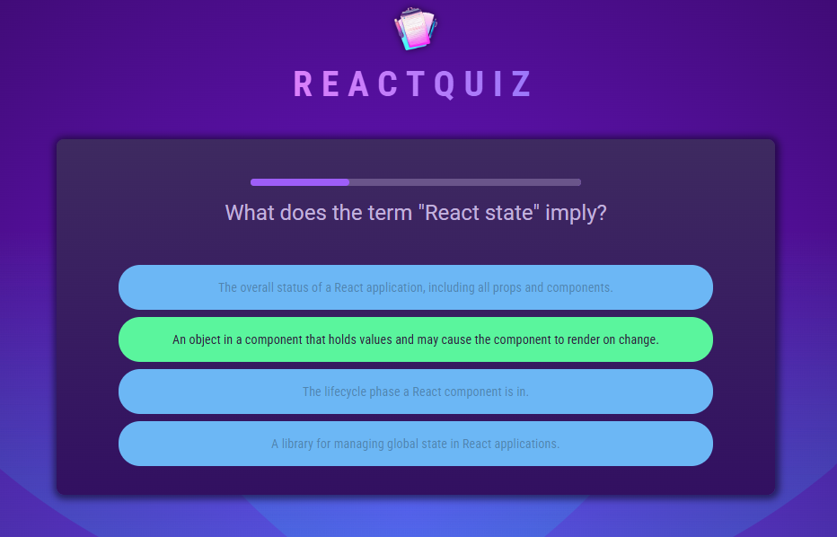
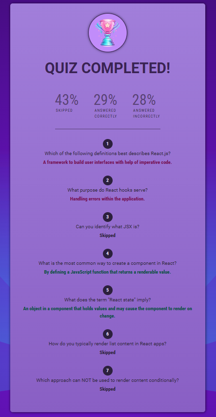

# React Quiz

This small project, developed with React, features a quiz on React concepts. It includes a timer for each question and tracks the score, indicating correct, incorrect, and skipped responses.

## Table of contents

- [Overview](#overview)
  - [Screenshot](#screenshot)
- [My process](#my-process)
  - [Built with](#built-with)
  - [What I learned](#what-i-learned)
  - [Continued development](#continued-development)
  - [Useful resources](#useful-resources)
- [Author](#author)
- [Acknowledgments](#acknowledgments)

## Overview

### Screenshot







## My process

### Built with

- React
- CSS custom properties
- CSS Flex box

### What I learned

During this project, I learned how to implement a timer using the JavaScript function setTimeout. I also explored the differences between setTimeout, setInterval, clearTimeout, and reset functions. "Additionally, I implemented the React hooks useEffect and useCallback.

```js
const handleSelectAnswer = useCallback(function handleSelectAnswer(
  selectedAnswer
) {
  setUserAnswers((prevUserAnswers) => {
    return [...prevUserAnswers, selectedAnswer];
  });
},
[]);
```

```js
useEffect(() => {
  const timer = setTimeout(onTimeOut, timeOut);

  return () => {
    clearTimeout(timer);
  };
}, [onTimeOut, timeOut]);
```

### Continued development

My goal is to further enhance my understanding of React hooks and custom hooks as I develop the app and ensure seamless integration with the backend.

### Useful resources

- [Example resource 1](https://www.udemy.com) - I developed this small application through the course Dive in and learn React.js from scratch! by Maximilian Schwarzmüller - Udemy.

## Author

- Website - [Daniela Serrano](https://github.com/danielaser)

## Acknowledgments

As a junior developer, I found the Udemy course Dive in and Learn React.js from Scratch! by Maximilian Schwarzmüller to be incredibly valuable. It has helped me create cleaner React applications and gain a better understanding of key concepts.
